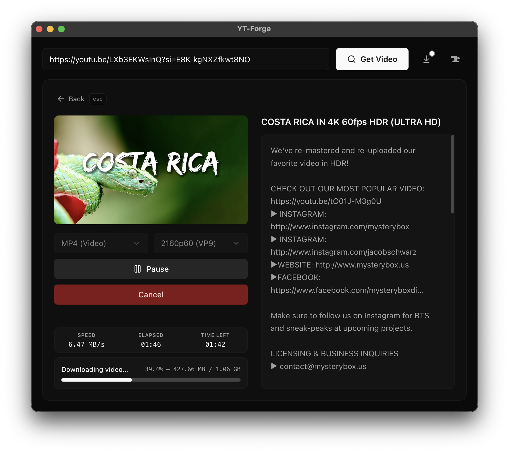
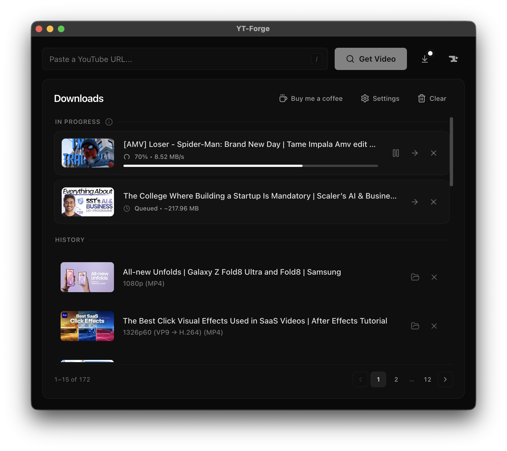

<div align="center">
  

  <h1>YT-FORGE</h1>

  <p>
    A fast, modern desktop universal video downloader designed for creators and editors.
  </p>

  <p>
    macOS • Windows • Linux <br/>

  </p>

  <p>
    <a href="https://yt-forge.com/"><strong>yt-forge.com</strong></a>

  </p>
</div>

---

## Overview

**YT-FORGE** is a fast, lightweight desktop **universal video downloader** and **yt-dlp GUI wrapper** built on top of the powerful [`yt-dlp`](https://github.com/yt-dlp/yt-dlp) engine.

It focuses on three things:

• Speed  
• Simplicity  
• Editor-friendly downloads

Unlike many downloaders, YT-FORGE prioritizes **H.264 video and AAC audio** formats, ensuring smooth playback and seamless compatibility with professional editing software such as **Premiere Pro**, **Final Cut Pro**, and **DaVinci Resolve**.

---

## Features

- **1,000+ Sites Supported**  
  Downloads from YouTube, X, Instagram, TikTok, Reddit, and basically anywhere else supported by `yt-dlp`.

- **Fast Downloads**  
  Powered by the battle-tested `yt-dlp` engine.

- **Minimal Interface**  
  Clean dark UI built with React and Shadcn UI.

- **Editor-Friendly Formats**  
  Automatically prefers H.264 + AAC (MP4) over AV1/VP9.

- **Built-in H.264 Conversion**  
  Easily convert downloaded VP9 or AV1 videos to H.264 directly within the app for maximum compatibility.

- **No Ads. No Tracking.**  
  Source-available and transparent.


---

## Interface

<p align="center">
  
  &nbsp;
  
</p>

---

## Download

| OS | Hardware / Architecture | Direct Download (v2.0.1) |
|--------|---------------------|--------------------------|
| **macOS** | Apple Silicon (M Series) | [Download .dmg](https://github.com/YT-Forge-Official/YT-Forge/releases/download/v2.0.1/YT-Forge-2.0.1-arm64.dmg) |
| **Windows** | Intel / AMD & Snapdragon (ARM) | [Download .exe](https://github.com/YT-Forge-Official/YT-Forge/releases/download/v2.0.1/YT-Forge-Setup-2.0.1.exe) |
| **Linux** | Intel / AMD (Standard PCs) | [.AppImage](https://github.com/YT-Forge-Official/YT-Forge/releases/download/v2.0.1/YT-Forge-2.0.1.AppImage) &nbsp;·&nbsp; [.deb](https://github.com/YT-Forge-Official/YT-Forge/releases/download/v2.0.1/yt-forge_2.0.1_amd64.deb) |
| **Linux** | ARM Devices (Raspberry Pi, etc.)| [.AppImage](https://github.com/YT-Forge-Official/YT-Forge/releases/download/v2.0.1/YT-Forge-2.0.1-arm64.AppImage) &nbsp;·&nbsp; [.deb](https://github.com/YT-Forge-Official/YT-Forge/releases/download/v2.0.1/yt-forge_2.0.1_arm64.deb) |

**Latest release:**  
https://github.com/YT-Forge-Official/YT-Forge/releases/latest

---

## Security Notice

Because this is an independent source-available application without enterprise code-signing certificates, your operating system may show a warning on first launch.

**Windows:**  
`More Info` → `Run Anyway`

**macOS:**  
Open the app once, dismiss the warning, then go to  
`System Settings → Privacy & Security` and click **Open Anyway** next to the YT-Forge message.

If macOS instead says the app *"is damaged and can't be opened"*, the download was
flagged by quarantine. Clear it with:

```bash
xattr -dr com.apple.quarantine /Applications/YT-Forge.app
```

This approval is required **only once**.

---

## Legal

YT-FORGE is a graphical interface for the open-source **yt-dlp** project.

This application does not modify or circumvent the original software.

Please download only content that you have permission to access or distribute.

---

## License

YT-Forge is **source-available**, not open source.

It is licensed under the [PolyForm Noncommercial License 1.0.0](LICENSE). In plain terms:

- **Allowed** — personal use, hobby projects, study and research, and use by charities, schools, public research bodies and government institutions. You may read, modify, fork and redistribute the source for those purposes.
- **Not allowed** — any commercial purpose. You may not sell YT-Forge, ship it inside a paid product, or rebrand it and monetise it.

"YT-Forge", the YT-Forge name and the YT-Forge logo are trademarks of the author and are **not** licensed by the above. A permitted fork must be distributed under a different name and branding.

For a commercial licence, contact the author.

### Credits and third-party components

The initial Electron + Vite + React scaffold was derived from [PikoCanFly/electron-react-vite-starter-project](https://github.com/PikoCanFly/electron-react-vite-starter-project) (MIT). 

YT-Forge also bundles [yt-dlp](https://github.com/yt-dlp/yt-dlp) (Unlicense) and [FFmpeg / FFprobe](https://ffmpeg.org) (GPL-3.0-or-later), which it invokes as separate executables, and compiles in [BgUtils](https://github.com/LuanRT/BgUtils) (MIT) to obtain the YouTube "Proof of Origin" tokens that some videos require.

Full attributions and licence texts: **[NOTICE.md](NOTICE.md)**.

---

## Privacy

YT-Forge respects your privacy. There is no telemetry, analytics, or remote tracking. All of your downloads, search history, and settings are stored locally on your device.

For full details regarding network requests and optional features like YouTube sign-in, please read the **[Privacy Policy](PRIVACY.md)**.

---

<div align="center">
Built with Electron, React, and Vite.
</div>
